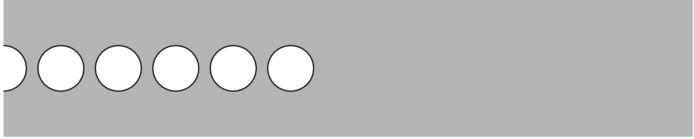
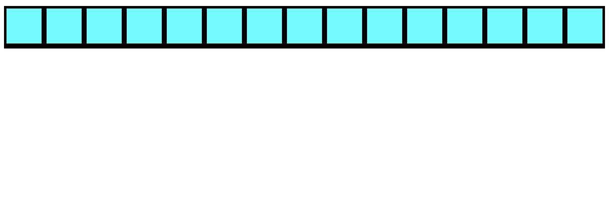
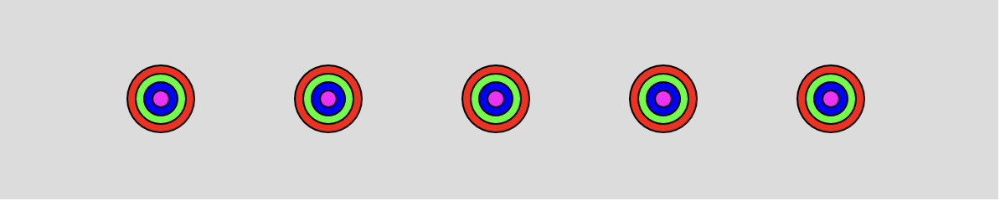
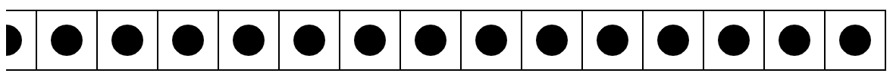

# While Loops

One of the biggest utilities of computers is their ability to repeat iterative processes. Computers are *really* good at repeating a task over and over again. 

A while loop repeats code while a condition is true. A while loop stops only when a condition is false.

```javascript
var x = 0
function draw(){
	// Condition to check if true
	while (x < 10) {
		// Runs while condition is true
		x++;
		console.log(x);
	}
	// Runs only once while loop is false
	console.log(“Done”);
}

```

## Tasks
**WARM-UP**: Do the following outside of the function draw and setup. 

- Modify the while loop to countdown from 100 to 0 by 1
- Create a new while loop to count up from 0 to 100 by 2
- Create a new while loop to give you all the powers of 2 (e.g. 2^0, 2^1, etc.) up to 10.
- Create a while loop that prints out your name 20 times

**CHALLENGE 1**: Use a while loop to create:
- Start the row at the left end of the canvas
- Draw the ellipses 50 pixels apart
- Draw ellipses only on the left half of the canvas



**CHALLENGE 2**: Use a while loop to make the following:
- Start the row at the left end of the canvas
- Draw the rectangles 40 pixels apart
- Have each rectangle start where the last one ended
- Fill with your favorite color!



**CHALLENGE 3**: Use a while loop to create:
- Start the row at x = 100 of the canvas
- Draw bullseyes that are 100 pixels apart
- **HINT**: Think about how to draw 1 bullseye then repeat the process!



**CHALLENGE 4**: Use a while loop to create:
- Start the row at the left end of the canvas
- Draw the rectangles 40 pixels apart
- Draw a circle on top
- **HINT**: Use rectMode(CENTER) to help with this!

